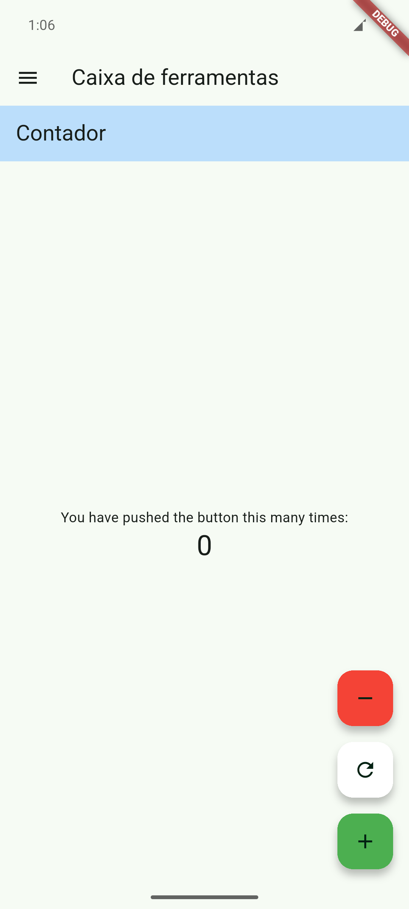
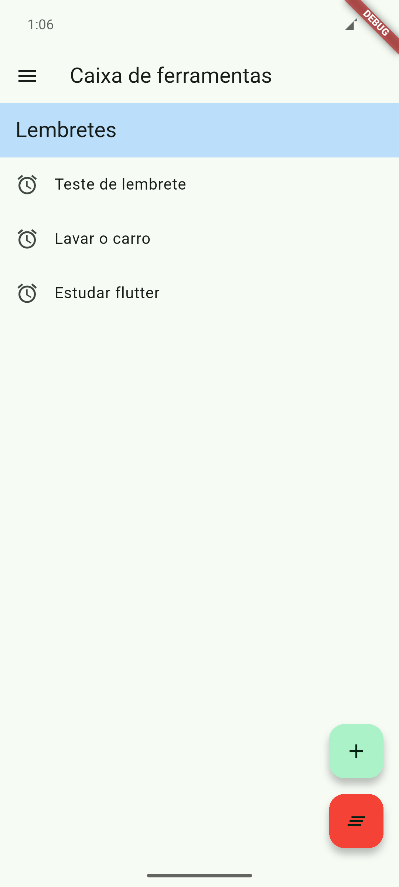
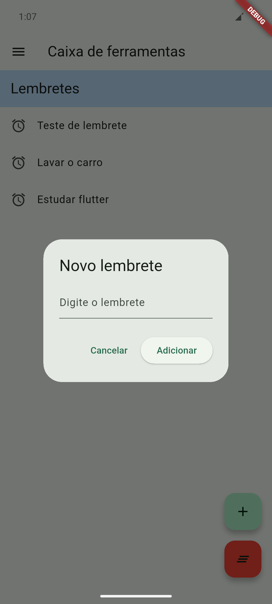
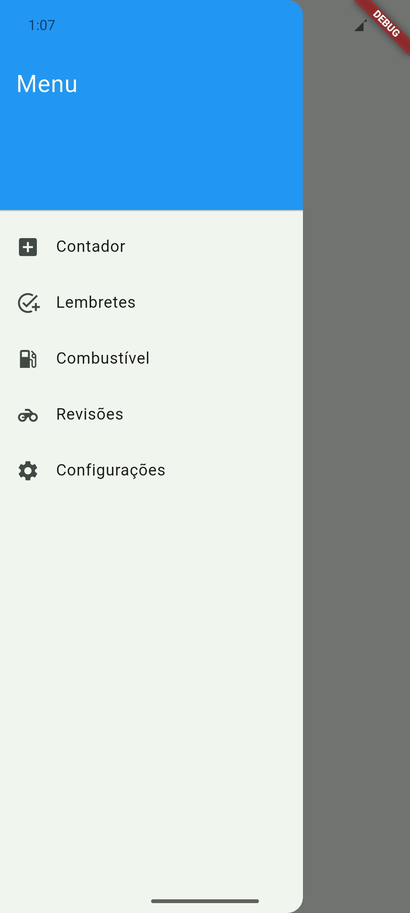

# FlutterUtils - Aplicativo de Utilidades Cotidianas

[](https://github.com/brenovambaster/app-flutter/releases/tag/v0.1.0)
[](https://github.com/brenovambaster/app-flutter/blob/main/LICENSE)
[](https://flutter.dev)
[](https://dart.dev)

Um aplicativo móvel em desenvolvimento com Flutter que reúne diversas ferramentas úteis para o dia a
dia, como contador, lembretes, gerenciamento de manutenção veicular e calculadora de combustível.

<!-- TOC -->
* [FlutterUtils - Aplicativo de Utilidades Cotidianas](#flutterutils---aplicativo-de-utilidades-cotidianas)
  * [🔍 Sobre o Projeto](#-sobre-o-projeto)
  * [🚀 Funcionalidades Planejadas](#-funcionalidades-planejadas)
  * [🛠️ Tecnologias Utilizadas](#-tecnologias-utilizadas)
  * [📋 Pré-requisitos](#-pré-requisitos)
  * [⬇️ Instalação](#-instalação)
  * [▶️ Como Rodar](#-como-rodar)
    * [Android / iOS](#android--ios)
  * [📄 Licença](#-licença)
  * [🤝 Contribuição](#-contribuição)
  * [📞 Contato](#-contato)
  * [Screenshots](#screenshots)
<!-- TOC -->

## 🔍 Sobre o Projeto

FlutterUtils está sendo desenvolvido como um projeto de estudo para implementar múltiplas
funcionalidades comuns em aplicativos móveis utilizando o framework Flutter. Este repositório
demonstra minha jornada de aprendizado e implementação de boas práticas no desenvolvimento mobile.

O objetivo é construir progressivamente um conjunto de ferramentas úteis em uma única aplicação,
explorando diferentes conceitos do Flutter como gerenciamento de estado, persistência de dados e
design de interfaces responsivas.

## 🚀 Funcionalidades Planejadas

Este projeto está em desenvolvimento ativo. Abaixo estão as funcionalidades que estão sendo
implementadas:

- [x] **Contador Interativo**: Implementação básica demonstrando gerenciamento de estado no Flutter.
- [ ] **Sistema de Lembretes**: Funcionalidade para criar, editar e gerenciar lembretes com
  notificações.
- [ ] **Gerenciador de Manutenção Veicular**: Ferramenta para acompanhamento de revisões e
  manutenções do veículo.
- [ ] **Calculadora de Combustível**: Conversor para analisar a relação de preços entre gasolina e
  álcool.
- [ ] **Interface Responsiva**: Layout adaptativo para diferentes tamanhos de tela.
- [ ] **Armazenamento Local**: Persistência de dados para guardar informações mesmo quando o
  aplicativo é fechado.

## 🛠️ Tecnologias Utilizadas

* **Linguagem de Programação**: Dart 3.7.2
* **Framework**: Flutter 3.29.2
* **Gerenciamento de Estado**: Provider (planejado)
* **Banco de Dados Local**: SQLite/Hive (planejado)
* **Notificações**: Flutter Local Notifications (planejado)
* **UI/UX**: Material Design 3

## 📋 Pré-requisitos

Para executar e desenvolver este projeto, você precisará:

* Flutter SDK 3.29.2 ou superior
* Dart SDK 3.7.2 ou superior
* Android Studio / VS Code com plugin Flutter
* Dispositivo físico ou emulador Android/iOS
* Git para clonar o repositório

> Recomendo fortementen usar o Android Studio com o plugin Flutter e dart. Isso ajudará na
> configuração do ambiente de desenvolvimento e execução

## ⬇️ Instalação

1. Abra o terminal e clone este repositório:
   ```bash
   git clone https://github.com/brenovambaster/app-flutter.git
   ```
2. Acesse a pasta do projeto:
   ```bash
   cd app-flutter
   ```
3. Instale as dependências do Flutter:
   ```bash
   flutter pub get
   ```
4. Verifique se tudo está configurado:

  ```bash
  flutter doctor  
  ```

## ▶️ Como Rodar

### Android / iOS

1. Conecte um dispositivo físico ou inicialize um emulador/simulador.
2. Execute o comando:
   ```bash
   flutter run -d <device_id>
   ```
   Ou apenas execute: ```flutter run```

3. Você pode listar seus dispositivos com:
   ```bash
   flutter devices
   ```

Caso queira gerar um APK de release:

```bash
flutter build apk --release
```

## 📄 Licença

Este projeto está sob a licença [MIT](https://opensource.org/licenses/MIT) – consulte o
arquivo [LICENSE](LICENSE) para mais detalhes.

## 🤝 Contribuição

1. Faça um _fork_ deste repositório
2. Crie sua branch de feature (`git checkout -b feature/nova-funcionalidade`)
3. Commit suas mudanças (`git commit -m 'Adiciona nova funcionalidade'`)
4. _Push_ para a branch (`git push origin feature/nova-funcionalidade`)
5. Abra um _Pull Request_ e aguarde revisão

---

## 📞 Contato

Breno Vambáster

GitHub: https://github.com/brenovambaster

E-mail: brenovambaster5@gmail.com

## Screenshots








